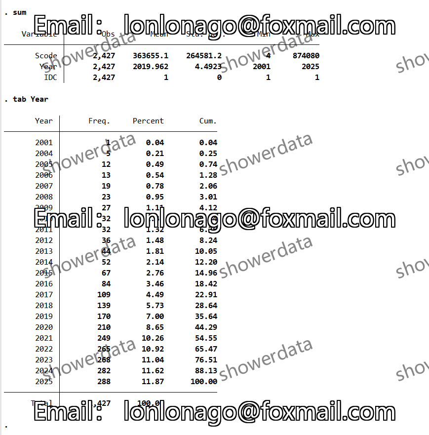
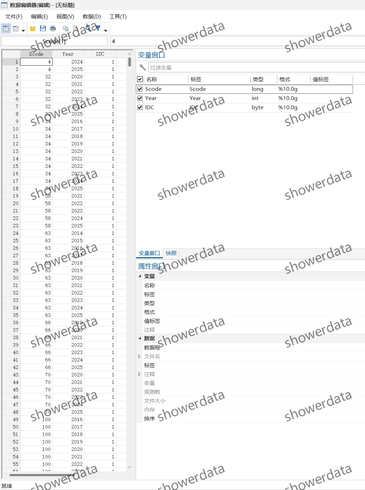
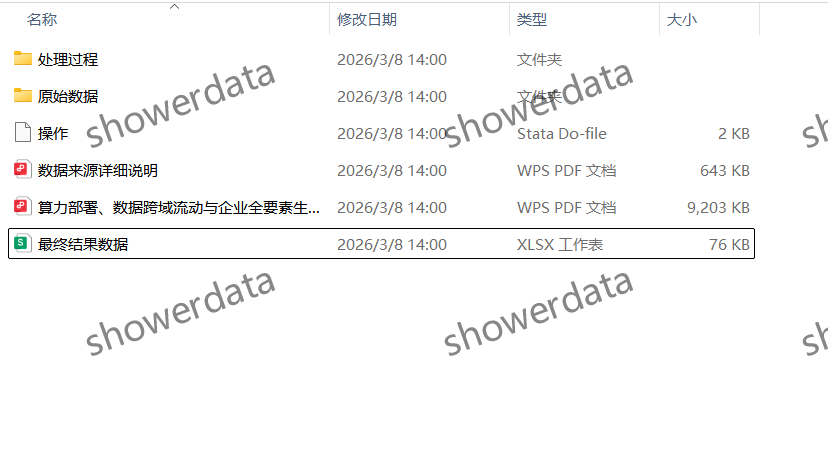

## Body

（2001-2025年）Public Company - Enterprise Computing Center Data and Computing Power Deployment

I. Data Introduction
(1) Data Details: See the image below for details, please read carefully before purchasing! The complete description is fully shown here, please confirm whether it is what you need before purchasing! No returns or exchanges will be accepted for any reason after shipment. Please confirm your ability to use the data before purchasing, no Q&A provided, thank you! There may be missing values due to objective reasons, if you are not willing to purchase, thank you!
(2) Data Name: Public Company - Enterprise Computing Center Data and Computing Power Deployment
(3) Sample Range: A Guangdong Commerce Company, 2427 observations
(4) Time Range: From 2001 to September 2025
(5) Data Format: Excel
(6) Data Content: Results, raw data, references, codes

II. Data Result Indicators as Shown in the Figure
All samples are labeled with an IDC of 1, excluding those labeled with an IDC of 0, if you are unwilling to purchase, please do not purchase.

III. Method of Indicator Construction as Shown in the Figure

IV. References as Shown in the Figure

## Images

Here is a pay link on Stripe ( https://buy.stripe.com/3cs8yP7sY87d0vu9AB ). Please contact me lonlonago@foxmail.com after funding $89, and I will send you a complete data files , thank you!

